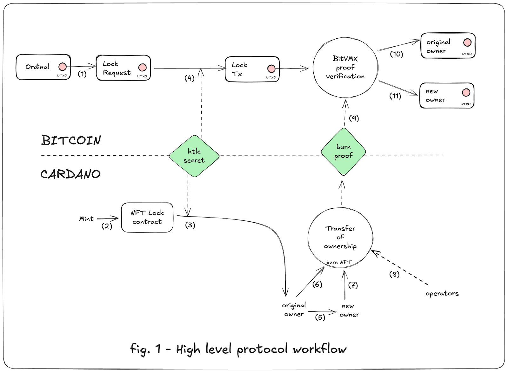
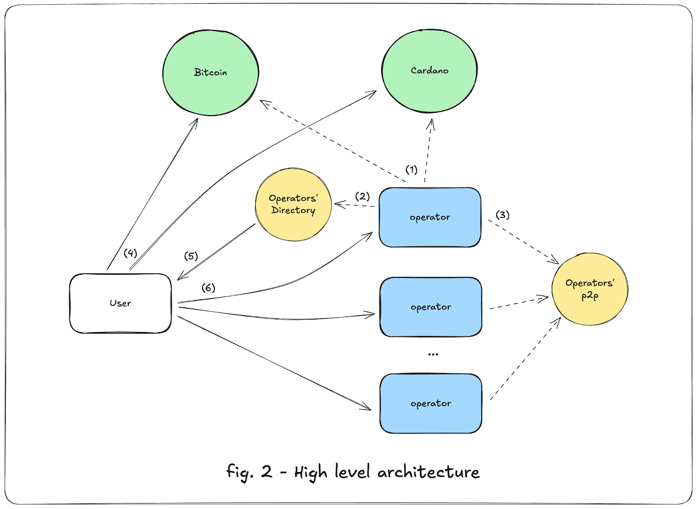
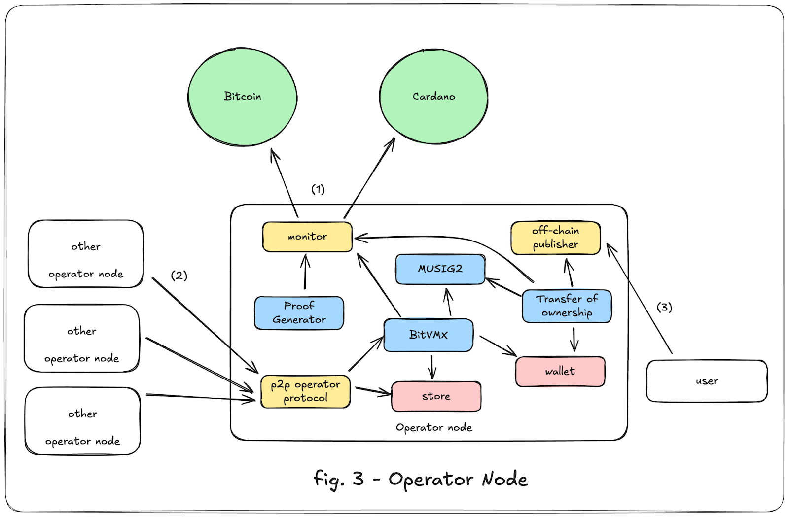
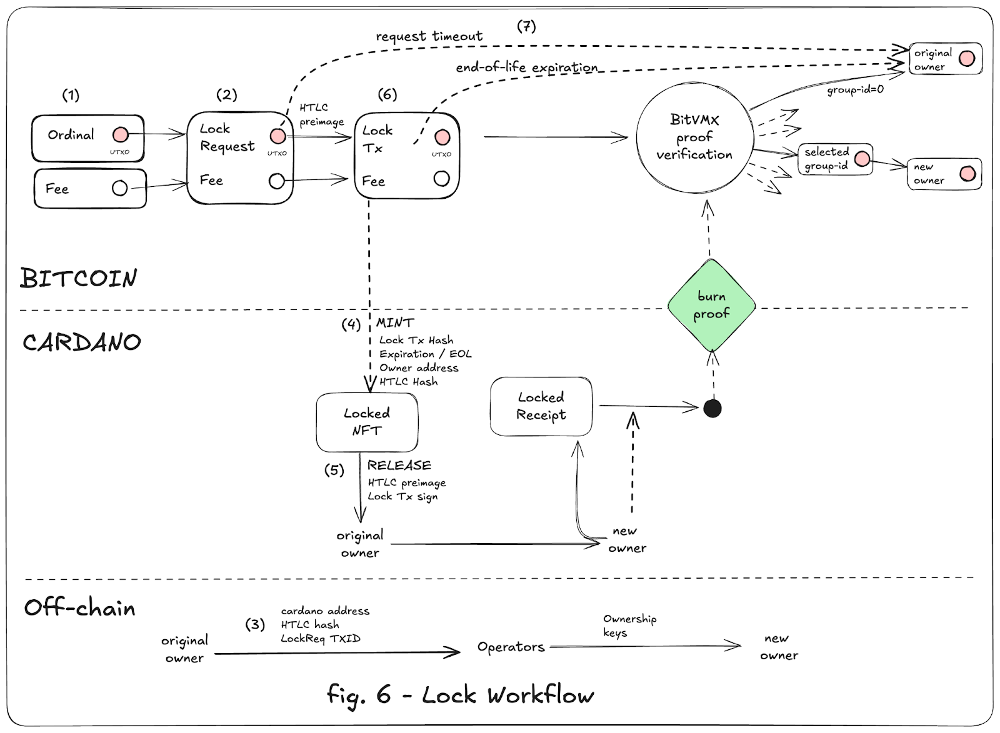
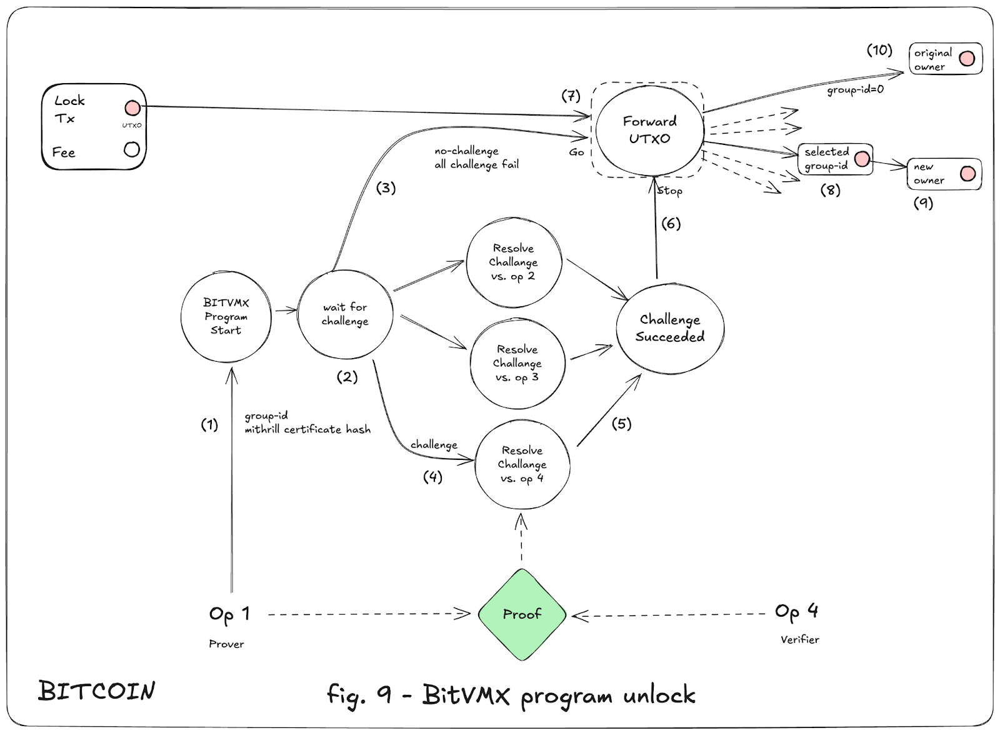

# Cardinal

## A Bitcoin-Cardano UTxO Wrapping Protocol for Ordinals & Beyond

### Protocol Design Specification

### Authors

| **Fairgate**       | **Input \| Output**  |
| :----------------- | :------------------- |
| Ariel Futoransky   | Nicolas Biri         |
| Diego Tiscornia    | Torben Poguntke      |
| Emilio Garcia      | Dimitar Jetchev      |
| Ramses Fernandez   | Jesus Diaz Vico      |
| Hernan Perez Rodal | Thomas Vellekoop     |
|                    | Romain Pellerin      |

| Revision | Description | Date |
| :------- | :---------- | :--- |
| v0.8 | **Initial Protocol Design** – MVP/Proof of Concept stage. **Not production-ready**; production release targeted for v1.0. | 2025-05-27 |

# Abstract

This document introduces Cardinal, a protocol for wrapping Bitcoin Unspent Transaction Outputs (UTxOs) onto the Cardano blockchain, using Bitcoin Ordinals as Cardano Non-Fungible Tokens (NFTs) as a primary example.

These wrapped UTxOs grant full transferability, enabling usage akin to native Cardano assets, while rigidly preserving a one-to-one peg with the original Bitcoin asset. On demand, users can burn the wrapped tokens to release the corresponding Bitcoin asset back onto its native blockchain.

To ensure security and reliability until recursive state proofs become available on Bitcoin and Cardano, our system is managed by a collective of operators who facilitate the secure and seamless transfer of assets between these networks. This protection is enforced via a trust-minimizing protocol predicated on the 1-out-of-n honest operator assumption.

Unlike traditional federated systems, which require an honest majority to maintain security, this approach ensures the integrity of assets with only a single honest operator.

Differentiating itself from many trust-minimized Bitcoin bridges, this system does not depend on external liquidity providers, though their integration remains feasible. Instead, a novel transfer-of-ownership mechanism is implemented, directly allocating Bitcoin assets to their verifiable owners.

Although this document primarily illustrates the system through the lens of NFT wrapping, the foundational principles are extensible to wrapping arbitrary UTxOs. Consequently, this system holds the potential to act as a fundamental layer for a wider scope of applications, encompassing cross-chain bridging of fungible tokens.

# 1\. Introduction

This document introduces Cardinal, a groundbreaking protocol that enables the minting of wrapped Bitcoin UTxOs, illustrated by the wrapping of an Ordinal as non-fungible tokens (cNFTs) on the Cardano blockchain. By wrapping Bitcoin UTxOs, this system bridges two distinct L1 blockchain ecosystems, allowing Bitcoin-based digital assets to seamlessly exist and operate within the Cardano blockchain.

These wrapped UTxOs implement full compatibility with Cardano's native asset standards[^1], making them transferable and usable in the same manner as any other asset on the Cardano blockchain. Crucially, the system ensures a strict 1-to-1 peg with the original Bitcoin asset, preserving its intrinsic value throughout its lifecycle.

At any point, the wrapped tokens can be securely burned on Cardano, triggering the release of the corresponding original asset back on the Bitcoin blockchain. This innovative approach not only extends the utility and reach of Bitcoin but also demonstrates the potential for cross-chain interoperability in handling fungible and non-fungible digital assets, and even the potential to become a main building block for more general solutions.

In the remainder of the paper, we focus on the Ordinals use case to illustrate the protocol’s mechanisms and behaviors. However, it’s important to note that the protocol ultimately supports any type of Bitcoin UTxOs as discrete units.

This document is organized as follows:

* **Section 1** (this one) introduces key concepts and definitions referenced throughout the design.
* **Section 2** describes the **general architecture** of the protocol, detailing its core components and interactions.
* **Section 3** provides a **technical specification** of the protocol, explaining the **locking and unlocking mechanisms** and the process for **generating and verifying cross-chain proofs**
* **Section 4** provides an **On-Chain Example**
* **Section 5** concludes with a **summary**.
* **Section 6** gives a perspective on **extending the protocol**.

## 1.1. Security Assumptions

The proposed system for minting and managing wrapped Bitcoin Ordinals as NFTs on the Cardano blockchain operates under the following security assumptions:

### 1.1.1. 1-out-of-n Honest Operator

The system relies on a decentralized group of operators to manage all required processes between the Bitcoin and Cardano blockchains. It assumes that, at any given time while assets are held within the protocol, at least one operator in the set remains honest, available, and compliant with the protocol’s rules.

The protocol has very specific availability requirements, which implies an honest operator must support an infrastructure capable of maintaining that level of availability. This means planning for appropriate failure rates as well as reasonable denial of service attacks at the network level.

### 1.1.2. Blockchain censorship

The system assumes that neither the Bitcoin nor the Cardano blockchain will be subject to sustained, coordinated censorship preventing the inclusion of protocol transactions in blocks. However, it is recognized that adversaries could attempt to censor transactions by submitting competing transactions with significantly higher fees, effectively bidding for block space to delay or exclude the protocol's transactions. While this type of attack is theoretically possible, sustaining it over an extended period requires costs that scale at least linearly with the duration of the attack.

This reliance on fee competition links directly to the economically bounded security assumption. An adversary must continually outbid the protocol's transactions, which becomes prohibitively expensive over time, especially given the fee dynamics and network conditions on both blockchains. Honest operators can mitigate such attacks by adjusting fees dynamically, ensuring the protocol remains resilient within its economic limits.

### 1.1.3. Blockchain Finality

The protocol assumes that the finality of transactions on both the Bitcoin and Cardano blockchains remains intact and consistent with their respective consensus mechanisms. For Bitcoin, this means the system adheres to the common standard of requiring multiple block confirmations (e.g., 6 confirmations) to consider a transaction as final and resistant to double-spending attacks. Similarly, on Cardano, the system relies on Ouroboros’ probabilistic finality, assuming that transactions are effectively irreversible once included in a sufficient number of blocks.

To mitigate the risk of reorganization attacks or delayed finality, the protocol incorporates sufficient safety margins in its operations, such as waiting for additional confirmations before completing cross-chain actions. The system's security depends on both blockchains' ability to resolve forks and prevent adversarial chain reorganization within reasonable timeframes

### 1.1.4. Resource bounded adversaries

The system operates under the assumption that adversaries are resource-bounded, meaning they have limited computational, economic, and network resources to execute attacks. For example, adversaries are assumed to be unable to gain control of a majority of the mining or staking power on either blockchain. This ensures that the underlying consensus mechanisms of Bitcoin and Cardano remain secure.

Additionally, the protocol assumes that adversaries face practical limits when launching denial-of-service (DoS) attacks, attempting to exhaust operator resources, or flooding the network with invalid transactions. Honest operators must be capable of mitigating such attacks through infrastructure that can scale appropriately and recover from disruptions. The system also presumes that adversaries cannot feasibly break cryptographic primitives, such as digital signatures or hash functions, which are foundational to securing wrapped tokens and cross-chain operations.

### 1.1.5. Rational Adversary

The system assumes that adversaries are rational economic actors who will not spend resources beyond what they stand to gain. Specifically, it is unlikely that an adversary would invest more in an attack than the total value of the assets they aim to compromise or the potential short-term profits from related financial instruments. To address this, the protocol incorporates a conservative security margin, assuming that adversaries may allocate up to 10 times the value of the protected assets to execute an attack.

For example, if the protocol safeguards assets worth $X, it is designed to remain secure even against adversaries willing to spend as much as 10 times $X on malicious activities. This assumption applies to both direct attacks, such as attempts to compromise operators or manipulate protocol mechanisms, and indirect strategies, including artificially inflating transaction fees or orchestrating denial-of-service attacks. By accounting for adversaries' rational economic motivations, the protocol ensures strong security guarantees and incentivizes honest participation, while maintaining resilience against resource-intensive threats.

Reputational attacks, however, introduce complexities that are difficult to quantify. Unlike economic attacks with clear cost-benefit calculations, reputational attacks may have indirect, long-term, or unpredictable consequences, making it challenging to estimate the actual incentives and resources adversaries might allocate toward them. As such, the potential cost and impact of reputational attacks are not factored into the security budget assumptions considered in this model.

## 1.2. Verifiable computing on Bitcoin

Cardano offers robust support for expressive smart contracts, enabling developers to create complex decentralized applications and execute intricate logic directly on-chain. In contrast, Bitcoin has limited programmability. Its script language only supports a small set of predicates that control the unlocking of unspent transaction outputs (UTxOs), making it suitable for simple locking conditions but insufficient for complex programmatic interactions.

Bitcoin’s UTxO model presents additional constraints: UTxOs cannot carry state across transactions. Each UTxO exists independently, and Bitcoin lacks native mechanisms to share or persist state among UTxOs, further limiting its ability to handle advanced computations.

### 1.2.1. BitVMX

BitVMX addresses these limitations by introducing verifiable computation on Bitcoin, a novel approach that enables the execution of arbitrarily complex programs while maintaining Bitcoin’s core design principles. By combining Bitcoin’s minimal scripting capabilities with off-chain computation, BitVMX allows developers to execute complex programs without requiring modifications to Bitcoin's base layer.

Programs intended for use in BitVMX are written in a variety of high-level languages and compiled into RISC-V compatible binaries. These binaries can then be executed and verified as part of the BitVMX framework. When disputes arise over the correctness of a computation, the system enables participants to resolve these disputes using Bitcoin’s scripting system. This is achieved through a step-by-step validation process on-chain that narrows down the challenge to the execution of a single RISC-V instruction. As a result the complete computation is valid and malicious actors penalized.

### 1.2.2. Program inputs and Winternitz signatures

BitVMX utilizes Winternitz signatures, an optimization of one-time Lamport signatures, to manage program inputs and protocol messages in its challenge-response protocol. These signatures enable secure and verifiable communication between UTxOs, ensuring the integrity of program operations within the Bitcoin network.

Program inputs are encoded and signed with Winternitz signatures as part of the UTxO witness data. The corresponding Winternitz public key and verification script are included in the UTxO script, allowing other participants to verify the inputs' validity during on-chain execution. This mechanism ensures that each program step is cryptographically secure and adheres to the protocol’s rules.

The use of Winternitz signatures introduces a significant expansion factor, approximately 200x, meaning that each signed byte of input data generates 200 Bitcoin virtual bytes when accounting for both witness and script data. This expansion factor directly impacts the size of transactions and the associated fees, making it an important consideration for the protocol's on-chain cost structure.

As a result the protocol is designed to minimize input size whenever possible, making use of available  trade-offs.

### 1.2.3. Multiparty inputs and interactive protocols

The BitVMX framework can be extended to support interactive verifications by enabling both the prover and verifier to supply program inputs. In this approach, the prover and verifier alternately provide a sequence of Winternitz-signed inputs of predefined sizes. These signed inputs are then combined into a single structured buffer, which serves as the input for the RISC-V program executed within the BitVMX virtual machine.

This extension allows for the execution of complex verification logic that, while feasible to express in zero-knowledge proof systems, would be prohibitively expensive to generate proofs for. Although zero-knowledge proofs offer succinct and efficient verification, the computational cost of proof generation for certain classes of computations can be too high to be practical. By leveraging interactive protocols, we expand the range of feasible applications, allowing for the validation of intricate computations without incurring excessive proof-generation costs or requiring specialized non-commodity hardware.

## 1.3. Public key and signature aggregation

The protocol relies on public key cryptography as the foundation for securing transactions and verifying their integrity across both the Bitcoin and Cardano blockchains. This includes signing transactions, verifying signatures, and implementing multi-signature schemes for enhanced security and efficiency.

### 1.3.1. Public Key Cryptography on Bitcoin and Cardano

1. **Bitcoin:**
   Transactions on Bitcoin are signed and verified using cryptographic schemes based on the Elliptic Curve Digital Signature Algorithm (ECDSA) and the BIP340 Schnorr signature scheme. Schnorr signatures, introduced via the Taproot upgrade, provide enhanced efficiency, flexibility for multi-signature schemes, and support for signature aggregation.
2. **Cardano:**
   Cardano uses EdDSA (Edwards-curve Digital Signature Algorithm) for transaction signing and verification. EdDSA offers strong security guarantees and integrates seamlessly with Cardano's extended UTxO (eUTxO) model, enabling expressive smart contracts and advanced cryptographic functionalities. Additionally, Cardano utilizes BLS (Boneh-Lynn-Shacham) signatures for its Mithril protocol[^2] as well as blockchain state proof verification and transaction-inclusion-proof verification.

### 1.3.2. Key Aggregation and Multisignatures

The protocol employs key aggregation for multisignatures and batch verification to optimize security and efficiency in both blockchain environments, in terms of computational as well as space requirements.

#### 1.3.2.1. Bitcoin

The MUSIG2 protocol is used within the Schnorr cryptosystem to enable key aggregation and multisignatures. MUSIG2 allows multiple participants to collaboratively produce a single aggregated public key and corresponding aggregated signature.

#### 1.3.2.2. Cardano

While EdDSA is the primary cryptographic standard for transaction signing, Cardano's Mithril protocol leverages BLS signatures for stake certificate aggregation. BLS signatures allow multiple signatures to be combined into a single compact signature, making them ideal for verifying checkpoint certificates in a distributed manner. This design enhances scalability and improves the performance of lightweight clients and state verification processes, aligning with Cardano's emphasis on efficiency and decentralization.

#### 1.3.2.3. Within the protocol

MUSIG2 plays a critical role in the protocol's wrapping system by enabling the creation of n-out-of-n aggregated addresses controlled by multiple participants. These addresses ensure that the system operates securely and efficiently under the 1-out-of-n trust-minimizing model. MUSIG2 is applied in various ways to support the protocol's operations:

**Pairs of Operators**
BitVMX implements pairwise subprotocols among operators, leveraging MUSIG2 to create single-address aggregated keys. These pairwise MUSIG2 addresses are used to generate pre-signed transactions, the so-called emulated covenants, ensuring that specific transactions can be executed securely between two operators. This setup is essential for managing program inputs, dispute resolution, and partial asset transitions within the system, where two parties must coordinate actions.

**All Operators**
For system-wide asset management, a single MUSIG2-based aggregated address is constructed using the public keys of all operators. This address enables the collective management of assets and allows the system to implement advanced covenants on Bitcoin. The all-operators MUSIG2 address is used for tasks requiring the participation or consensus of the entire operator set, ensuring that assets are securely controlled and that key operations are only performed when authorized by the collective.

**Per UTxO Operator’s Power Set**
The transfer of ownership protocol relies on MUSIG2 to create multiple aggregated addresses, one for each possible subset of operators (the power set of operators). These addresses are precomputed and associated with specific UTxOs, enabling flexible and secure unlocking of assets during the protocol's ownership transfer phase.

## 1.4. Bitcoin Ordinals

Bitcoin Ordinals define a convention for uniquely identifying, tracking, and transferring non-fungible assets on the Bitcoin blockchain. Inscriptions allow arbitrary content to be attached to these tokens, enabling the creation of digital artifacts on Bitcoin.

Within the Cardinal protocol, beyond the handling of fungible assets, it supports a distinct use case where an Ordinal can be locked on Bitcoin while a wrapped version becomes available on Cardano. This enables innovative use cases, like for example to stake, sell, borrow against, or lend the user’s Bitcoin asset (held in one particular UTXO) on the Cardano blockchain.

The Ordinal’s identity is determined by the transaction hash of the lock transaction, ensuring a deterministic and tamper-proof link between the original asset and its wrapped representation. This guarantees that the wrapped Ordinal maintains a strict 1:1 relationship with its Bitcoin counterpart.

## 1.5. Collateral

The system is designed to operate without requiring collateralization proportional to the value of assets handled. Unlike other protocols that require operators to lock funds in proportion to the total asset volume, this system uses a fixed stake model for operator participation. The required stakes remain independent of the specific value of wrapped assets, ensuring accessibility for operators regardless of transaction volume. Instead of collateral reserves, the protocol enforces honest behavior through a combination of fixed staking requirements, economic penalties, and cryptographic security mechanisms, ensuring secure and reliable execution.

### 1.5.1. Stake-Based Honesty Incentives

Operators are required to stake a predefined BTC value to participate in the system. This stake serves two purposes:

**Operator Honesty**: The stake acts as a deterrent against dishonest behavior. In the event of malicious or non-compliant actions, the protocol enforces slashing mechanisms that penalize dishonest operators by confiscating a portion or the entirety of their stake.

**Challenge Coverage:** During the challenge-response phase, the protocol ensures that the challenging party covers the transaction costs incurred by their challenge. This mechanism guarantees that the costs of executing and verifying disputes are borne by the party initiating the challenge, discouraging frivolous disputes while keeping the protocol economically efficient.

### 1.5.2. No Additional Collateral Requirements

No additional collateral proportional to the value of wrapped assets is required for system operation. The protocol's design prioritizes efficiency and trust minimization, relying on a combination of operator stakes, cryptographic guarantees, and robust penalty mechanisms to maintain security and operational integrity. This ensures that the system remains lightweight, economically sustainable, and accessible for participants without the need for over-collateralization or liquidity reserves.

## 1.6. Operator

Operators are the core participants in the protocol, performing critical roles to ensure the secure and efficient functioning of the system. They are responsible for both assisting users with wrapping and unwrapping Bitcoin Ordinals and preventing other operators from engaging in dishonest behavior or attempting to steal assets. Operators perform the following key tasks:

### 1.6.1. Assisting Users with Wrapping and Unwrapping

**Monitoring Blockchains:** Operators continuously monitor the Bitcoin and Cardano blockchains for transactions related to the protocol. This includes detecting wrapping or unwrapping requests initiated by users and verifying the inclusion and finality of such transactions.

**Cooperation and Setup:** Operators communicate and coordinate with each other to complete protocol operations. This involves setting up the necessary covenants, participating in key aggregation, presigning transactions, and establishing the required addresses to manage wrapped assets.

**Signing and Presigning Transactions:** Operators collaboratively sign transactions required to mint wrapped NFTs on Cardano or to release the corresponding assets on Bitcoin. They also presign transactions as part of the protocol’s dispute resolution and challenge-response mechanisms, ensuring the smooth execution of complex workflows.

### 1.6.2. Preventing Dishonest Behavior

**Monitoring and Dispute Resolution:** Operators actively monitor the protocol for signs of dishonesty or attempted theft by other operators. If cheating or protocol violations are detected, they initiate the appropriate challenge-response process (see Chapter 3.3) to dispute and verify the correctness of transactions or computations.

**Ensuring Security:** By participating in the 1-out-of-n trust-minimizing model, operators ensure the security of the protocol. Even if some operators act maliciously, a single honest operator is sufficient to prevent asset theft or protocol failure.

**Managing Secrets**: Operators are responsible for securely managing cryptographic secrets and private keys associated with the protocol. They must ensure that this sensitive information is stored in a robust and privacy-preserving manner, or securely destroyed when required.

**Revealing Information:** Operators reveal specific information only to the right parties and only when required by the protocol. For instance, during the challenge-response process, an operator may need to reveal parts of a computation or presigned transaction to resolve a dispute while maintaining privacy for unrelated data.

## 1.7. User

Users are the main stakeholders of the system, driving the purpose and utility of the Cardinal Protocol. This section outlines the user-centric design principles and considerations that shape the protocol to ensure accessibility, usability, and security.

### 1.7.1. Target Audience

The system is designed for Bitcoin users who wish to extend their DeFi interactions without sacrificing decentralization or the security of their Bitcoin assets. This user group may include holders of Bitcoin and Ordinals who wish to leverage Cardano's smart contract capabilities, efficient transaction costs, or diverse decentralized applications (dApps).

Additionally, the system accommodates:

**Cardano native users** who are interested in interacting with Bitcoin or bridging assets between the two ecosystems.

**Dual Bitcoin-and-Cardano users** who already operate across both blockchains and seek a seamless way to wrap, transfer, and utilize Bitcoin assets as native assets on Cardano.

### 1.7.2. Simplified Onboarding and Accessibility

To maximize accessibility, the protocol is designed to minimize the complexities and requirements typically associated with cross-chain systems:

**Single-Currency Starting Point**: Users can participate in the protocol using only Bitcoin. There is no requirement to acquire ADA or interact with Cardano-native currency to begin wrapping Bitcoin assets. This design ensures that Bitcoin users can easily onboard without additional barriers.

**Non-Technical Accessibility:** The system is tailored for non-technical users, relying on an intuitive interface integrated into popular wallets that support both Bitcoin and Cardano. This eliminates the need for users to understand the technical intricacies of cross-chain interactions.

**Seamless wallet integration:** The protocol is designed to integrate with widely-used wallets that support both Bitcoin and Cardano. The system will integrate first with the Lace wallet which provides support for both Bitcoin and Cardano, ensuring seamless interaction with assets on both blockchains.

### 1.7.3. Decentralization and Trust

The system's trust-minimizing design ensures that no single entity has unilateral control over the locking, unlocking, or transfer of wrapped Bitcoin Ordinals. By distributing control among a set of independent operators, it eliminates the need for a centralized custodian, reducing counterparty risk and enhancing security.

This approach appeals to users who prioritize decentralization, as it aligns with the core principles of blockchain and Bitcoin philosophy—namely, self-sovereignty, censorship resistance, and trust minimization. Unlike traditional custodial solutions, where users must entrust assets to a third party, this system ensures that assets remain verifiably secure and can only be unlocked under predefined cryptographic rules.

These characteristics are essential for driving adoption, as users increasingly seek trustless, transparent, and verifiable alternatives to centralized solutions when managing digital assets across blockchains.

## 1.8. Simplified Workflow

Here is a simplified version of the protocol workflow, starting from a Bitcoin ordinal (1), generating a wrapped NFT on cardano, and finishing with a transferred ordinal (10, 11).

The complete version is described in section 3, which includes additional details such as handling of fees, stakes and timeouts.

### 1.8.1. Lock

The user initiates the lock process by creating a lock request transaction (1), which transfers the UTxO to a Bitcoin script. This script requires an aggregate signature from the operators and a hashed time lock contract (HTLC) preimage chosen at random by the user. The user then communicates the transaction ID, HTLC hash, and their Cardano address to the operators.

Upon identifying the transaction, the operators begin a setup protocol procedure to generate all the necessary pre-signed transactions and ad-hoc keys needed to secure the UTxO. They then mint a wrapped asset on Cardano and lock it into a smart contract that will release it when presented with the HTLC preimage and bitcoin signature for the lock-tx (2).

Once the user reveals the HTLC preimage (3), the asset is transferred to their Cardano address. The operators use this revealed secret to complete the process on Bitcoin by finalizing the lock transaction (4).

At this point, the user possesses a wrapped asset on Cardano, which can be used to interact with other users or DeFi protocols. The asset may remain with the original user or be transferred to a new owner (5).

### 1.8.2. Unlock

Afterwards, the original owner (6) or new owner (7) decides to bring the tokens back to Bitcoin by requesting the burn of the assets using the transfer of ownership protocol. Operators monitoring this type of request will assist the user (8), wait for a Mithril certificate validating the finality of the burn transaction,  and start the BitVMX unlocking program on Bitcoin (9).

Other operators may challenge and prevent the unlocking of the assets on Bitcoin if the provided request is invalid. The challenge is resolved by verifying a zk-proof showing the burn transaction inclusion in a valid Mithril certificate.

Finally, the UTxO containing is transferred to (10) the original owner or (11) the new owner, depending on who had the tokens on Cardano at the start of the unlock request.

# 2\. General Architecture

The Bitcoin-Cardano BitVMX Ordinals wrapping system is managed by a group of operators that monitors the Bitcoin and Cardano Blockchains (1) to identify system related transactions and react accordingly. They publish operator information for users and other operators on the Operator’s directory (2), and use an off-chain p2p protocol for additional communication with other operators (3), (see sections 2.1.5 and 2.5).

Users interact with Bitcoin and Cardano blockchains (4), request information about current operators from the Operators directory (5), and have direct off-chain interactions with the operators (6).

## 2.1.  Operator node

Each operator runs the operator node software to participate in the protocol. The node is released as a group of docker containers that can be bootstrapped without any other dependencies on Linux x64 hosts.

Operator nodes interact with Bitcoin and Cardano blockchains through its monitor component (1), with other operator nodes via its p2p protocol component (3), and with users using its off-chain publisher component (2).

### 2.1.1. Monitor

The monitor component manages the operation of both Bitcoin and Cardano nodes, ensuring seamless transaction tracking and network connectivity. Its key responsibilities include:

* Transaction Indexing: Identifies and indexes transactions that match predefined templates based on transaction format, addresses, and transaction hash.
* Fee Estimation: Continuously analyzes network conditions to estimate the current transaction fees for both blockchains.
* Mempool Submission: Forwards newly created transactions to the appropriate Bitcoin or Cardano mempool for processing, and track inclusion.
* Network Health Monitoring: Detects and triggers an alarm if connectivity to either blockchain network is lost, ensuring prompt issue resolution.

To enhance efficiency and reduce infrastructure overhead, the monitor will leverage open-source light clients, which avoid downloading the whole blockchain transaction history.  It will include support for fast synchronization and reduced storage requirements. These lightweight implementations ensure that the system remains performant and accessible without requiring full-node operation.

### 2.1.2. Store

The Store component is responsible for securely managing and maintaining all protocol-related data. It ensures that critical information is stored, encrypted, and backed up for reliability and disaster recovery. Its key responsibilities include:

* **Data Storage:** Manages the storage of essential protocol data, including:
- Secrets required for cryptographic operations.
- BitVMX configuration settings.
- The state of BitVMX disputes
- Information about other operators participating in the protocol.
- Transaction records and status updates for monitoring and verification.

* **Database Management:** Uses RocksDB as the primary database for lightweight, efficient, and reliable data storage.

* **Data Encryption:** Ensures all stored information is encrypted at rest using a master key provided during node startup, safeguarding sensitive data against unauthorized access.

* **Backup and Disaster Recovery**: Periodically uploads encrypted store files to a backup site, ensuring redundancy and resilience against data loss.

### 2.1.3. Wallet

The Wallet component is responsible for managing and securing the signing keys required for interactions with both the Cardano and Bitcoin blockchains. Its primary functions include:

* **Key Management**: Handles the generation, storage, and usage of private keys necessary for signing transactions on both networks. Since the BitVMX protocol uses a high number of one-time private keys, the operator node must derive all these keys from a master secret.

* **Multi-Blockchain Support**: Maintains compatibility with Cardano’s EdDSA and Bitcoin’s Schnorr/ECDSA signature schemes, ensuring seamless interaction across both ecosystems.

* **Secure Signing**: Ensures that private keys never leave the wallet, using in-memory signing operations to prevent exposure.

Other secret storage requirements are handled by the store component (2.1.2) with similar security model considerations as the wallet.

### 2.1.4. Off-Chain Publisher

The Off-Chain Publisher provides redundant Web2 channels to ensure reliable data availability for users interacting with the protocol. It exposes multiple REST endpoints, enabling seamless access to protocol-related information.

**Key Responsibilities:**

* **Data Distribution**: Serves critical protocol data through RESTful APIs, ensuring users and operators can access real-time information.

* **Redundant Infrastructure**: Operates across multiple independent systems to enhance availability and fault tolerance.

* **Security and DDoS Mitigation**: Runs on isolated infrastructure to minimize attack surfaces and prevent denial-of-service (DoS) attacks from affecting core protocol operations.

**Alternative Publishing Mechanisms:**
To improve robustness and decentralization, the Off-Chain Publisher can leverage alternative distribution methods, including:

* **IPFS (InterPlanetary File System)** – Decentralized, content-addressable storage for tamper-resistant data availability.

* **AWS S3 or Similar Cloud Storage** – Reliable, scalable hosting for redundancy and high uptime.

### 2.1.5. P2P Operator Protocol

The P2P Operator Protocol facilitates secure and reliable communication between operators to coordinate BitVMX setup, transfer of ownership, and MuSig2 signature generation. It ensures encrypted message exchange, network health monitoring, and fault detection.

**Key Features:**

* **Pairwise Communication Only**
  * All interactions occur between pairs of operators, with no global message broadcasting.
  * Used for BitVMX setup, ownership transfer coordination, and MuSig2 signature generation.

* **Secure Communication**
  * All messages are transmitted via REST APIs secured with TLS encryption.
  * Ensures end-to-end confidentiality and prevents unauthorized data access.

* **P2P Health Monitoring**
  * Operators implement a ping and keep-alive mechanism to maintain active connections.
  * Regular checks ensure nodes are responsive and available for protocol operations.

* **Failure Detection & Reporting**
  * Communication failures, unresponsive nodes, or missing ACKs are detected and logged.
  * Operators report failures to prevent disruptions in protocol execution.

### 2.1.6. Proof generator

The Proof Generator is responsible for collecting blockchain data and producing verifiable proofs that confirm the inclusion and finality of key transactions across both Bitcoin and Cardano. These proofs ensure that protocol operations—such as locking, minting, transferring, and burning—are executed securely and transparently.

**Key Responsibilities:**

* **Burn Proofs on Cardano**
  * To confirm burn transactions on Cardano, the protocol leverages Mithril certificates to prove transaction inclusion and finality.
  * The Mithril certificate ensures that the group-ID selection transaction is securely recorded and finalized.

* **Mithril Certificate Validation**
  * Recursive verification of Mithril certificates is required, ensuring continuity up to a predefined snapshot number.
  * The proof generator selects optimized parameters for the interactive verification process, enabling efficient validation on commodity hardware without excessive computation. The total proof size is supposed to be under 16KB, ensuring practical proof generation and transmission.

### 2.1.7. MUSIG2

The protocol utilizes MuSig2 for key aggregation and signature generation on the Bitcoin blockchain using Schnorr signatures. This enables efficient multi-party signing, which is essential for secure cross-chain interactions.

**Key Responsibilities:**

* **Bitcoin Covenants Creation**
  * MuSig2 is required for emulating Bitcoin covenants, which enforce spending conditions on UTxOs.
  * These covenants ensure that assets remain securely controlled by the protocol until the required conditions for transfer or redemption are met.

* **Support for BitVMX Protocol**
  * The BitVMX protocol relies on MuSig2 for dispute resolution and conditional execution of verifiable off-chain computations.
  * By aggregating keys, the protocol ensures that operators can jointly enforce the execution of valid computations while preventing unauthorized state transitions.

* **Transfer of Ownership Address Generation**
  * MuSig2 is used to generate aggregated addresses for ownership transfers.
  * These addresses represent the collective control of assets by multiple operators, enabling a secure and flexible ownership transition mechanism.

* **Signature Aggregation & Privacy**
  * Multiple operators collaboratively generate a single aggregated public key, ensuring that all signers appear as a single entity on-chain.
  * This reduces transaction size, lowers fees, and prevents detection of multi-party coordination.

### 2.1.8. BitVMX

The BitVMX component is responsible for managing disprovable computing within the protocol. It facilitates verifiable off-chain execution while ensuring that dishonest participants can be penalized.

**Key Responsibilities:**

* **Verification Execution:** Runs verification programs on RISC-V virtual machines, enabling dispute resolution and proof-based computation.

* **Protocol Orchestration:** Responds to protocol events, ensuring that operations proceed correctly and securely.

* **Stake Management:** Handles operator stakes, enforcing penalties and slashing dishonest participants when necessary.

* **Disablement:** Has mechanisms to disable dishonest operators through detection of protocol failure.

* **Efficient Bitcoin Fee Management:** Optimizes transaction fees by leveraging *Child Pays for Parent (CPFP)* mechanisms, ensuring timely and cost-effective transaction processing.

## 2.2. User node

The User Node is responsible for running the protocol client system, providing a seamless user experience while maintaining security. It enables users to interact with the protocol efficiently, handling key management, transaction signing, and operator coordination.

**Key Responsibilities:**

* **Protocol Client Execution**
  * The user node implements the client-side logic required for interacting with the protocol, abstracting complexities while ensuring secure operations.
  * It runs on Linux systems and integrates with mainstream wallet software capable of signing transactions on both Bitcoin and Cardano.

* **Operator Directory Lookup**
  * Contact the Operators’ Directory to obtain the system configuration, operator endpoints, Bitcoin-linked addresses for transaction verification, and the Cardano policy ID used for managing wrapped assets.

* **Key Share Retrieval & Ownership Management**
  * Retrieves and verifies key shares through the transfer-of-ownership protocol.
  * Accesses the selected aggregated account, ensuring proper ownership transfer and secure signing.

**User Availability Considerations:**
Please note that there is no availability requirement for users. As long as the lock expiration is accounted for, users are not required to be online or actively monitoring either blockchain for their assets to remain secure within this system.

## 2.3. Token Policies and Smart contracts

The NFT Token Policies and Smart Contracts define the lifecycle rules that govern the creation, transfer, and destruction of wrapped Bitcoin assets on the Cardano blockchain. This system ensures that assets can only be minted under valid, verifiable conditions, and that their destruction is securely coordinated to enable unlocking the original UTxOs on Bitcoin.

Three smart contracts manage three distinct token types, each serving a specific role in the system.

**Tokens**

1. **Asset Token**
   Represents the wrapped Bitcoin Ordinal as NFT or fungible assets on Cardano. It is a non-fungible token (NFT) uniquely tied to a specific Ordinal UTxO, or representing wrapped assets tied to a locked UTxO on Bitcoin.

   These tokens are transferable, allowing users to interact with DeFi protocols, trade it, or transfer ownership while remaining locked on Bitcoin. Redemption (burning) of these tokens is required to trigger the unlocking process on Bitcoin.

2. **Reference Token**
   Serves as a control and anchor for the metadata associated with an NFT. It ensures consistency and immutability of key metadata fields, such as the origin of an Ordinal, timestamp, and linkage to Bitcoin transaction history. This token is not meant to be transferred between users; it is held by a smart contract to enforce access control and metadata integrity.

3. **Receipt Token**
   A temporary utility token used during the burning process. It acts as proof that a burn operation has been executed correctly and helps to coordinate the finalization of the unlock operation on Bitcoin. Once the process is complete and validated, the Receipt Token is also destroyed.

**Smart Contracts**

1. **Ref-token lock contract**
   The ref-token lock contract is used to store and manage update rules for the ref token during the life-cycle of the wrapping.
2. **Token lock contract**
   The token lock contract is used to store newly minted tokens and help coordinate the release and lock across Bitcoin and Cardano.
3. **Receipt lock contract**
   The receipt lock contract is used to store receipt for burned tokens to help coordinate transfer of ownership key exchange and selection.

## 2\. 4 Protocol Flow

### 2.3.1. Minting (1)

Tokens can only be minted under strict conditions defined by the minting policy:

* It requires a signature from the aggregated all-operators address, ensuring consensus among operators.
* Includes the Bitcoin lock transaction hash and the taproot transaction hash required for generating the signature witness, verifying that the original assets can be properly locked before releasing the wrapped assets, and that all setup operations have been completed.
* Specifies a maximum time/slot within which the minting must occur.
* Specifies an end-of-life expiration time/slot after which the wrapped tokens will be considered invalid.
* Specifies the owner address on the Cardano blockchain.
* Includes a HTLC hash to lock the tokens.
* In addition a reference token with metadata information is minted along with the wrapped asset in case of an Ordinal.
* The minted assets must be sent to the Token lock contract address.
* The minted Reference Token must be sent to the Reference Lock contract address

### 2.3.2. Release (2)

Minted tokens can be released under the following conditions:

* The HTLC preimage provided by the user is included.
* The signature witness for the Bitcoin lock transaction is included
* The transaction is processed before the maximum time/slot specified during mint.

If all these conditions are met, the tokens are transferred to the owner address specified during mint.

### 2.3.3. Burn Request (3)

The burn process is an irreversible operation that must be explicitly requested and signed by the token owner.

* Only Tokens created under this policy can be burned.
* To initiate the burn request, the owner must send the token and provide a public key  to the smart-contract. The key will be used for encryption in the transfer-of-ownership protocol, ensuring a secure transition back to Bitcoin.
* The reference token must also be burned.
* In exchange a token receipt is minted and transferred to the receipt lock contract.

### 2.3.4. Burn (4)

To finalize the burn, the token owner must:

* Provide an integer for the group-ID selection, which determines the subset of operators selected to participate in the transfer-of-ownership protocol.
* In addition the receipt token policy checks the end of life date

This confirms the correct destruction of the wrapped assets on Cardano.

### 2.3.5. Alternate Burn (5)

In the event that release (2) is not completed before the maximum time/slot, any operator can initiate a burn to remove the assets and the reference token from the token lock contract on Cardano.

### 2.3.6. Update (6)

After the end of life of a token, anyone can update the reference token metadata to signal that the asset has expired.

## 2.5. Operators’ Directory

The Operators' Directory is a structured registry that maintains up-to-date information about each operator, enabling users and other operators to interact with them efficiently across Web2, Bitcoin, and Cardano networks.

**Key Information:**

* Operator Identification & Blockchain Addresses
  * Stores Bitcoin and Cardano addresses for each operator.
  * Maintains transaction hashes for stake deposits and collateral commitments for transparency.
* Off-Chain Communication Endpoints
  * Lists URLs for direct REST services, allowing secure protocol interactions.
  * Provides S3 storage links for redundancy and alternative data access.
  * Includes IPFS addresses for decentralized, tamper-resistant data availability.
* Availability & Status Tracking
  * Monitors and updates the availability status of each operator.

#

# 3\. Protocol Details

This section describes the wrapping protocol for the Ordinal use case in detail.

## 3.1. Locking

The locking workflow ensures the secure transition of a Bitcoin Ordinal into its wrapped form on Cardano.

1. **Lock Request Initiation**
   The owner holds an Ordinal UTxO along with Bitcoin funds to cover protocol fees **(1).**
   * The owner creates a HTLC preimage and calculates an associated HTLC hash.
   * The owner requests the all-operators aggregated address and constructs a lock-request transaction (**2**).
   * This transaction includes the Ordinal to be locked, along with protocol fees in bitcoin to cover the costs of optimistic operations on both Bitcoin and Cardano.

The lock request transaction provides two possible outcomes:

* It can be redeemed by an aggregated signature from all operators  and the HTLC preimage to finalize the lock (**6**).
  * If not accepted within a specific timeframe, the owner can reclaim the asset (**7**).

2. **Off-Chain Coordination**
   Next, the user contacts operators off-chain **(3)**, providing details of the lock request transaction, including the transaction id, HTLC hash, and Cardano address for the user. The operators identify the request and begin the setup process, including:
   * Creating BitVMX pre-signed transactions and secrets (see [BitVMX: A CPU for Universal Computation on Bitcoin](https://arxiv.org/abs/2405.06842))
   * Generating transfer-of-ownership aggregate keys.

   Before proceeding, the operators verify that the request timeout provides sufficient time to complete these steps securely.

3. **Cardano Minting Preparation**
   Once the setup is completed, operators sign the Cardano minting transaction (**4**), and send the tokens to the lock contract, this transaction includes:
   * The Bitcoin lock transaction hash as identification.
   * An expiration time aligned with the Bitcoin lock request expiration **(7)**  minus a safety margin (to avoid potential race conditions).
   * An end-of-life time aligned with the Bitcoin lock end-of-life expiration minus a safety margin.
   * The owner’s Cardano address as the recipient of the wrapped NFT.
   * The HTLC hash.
   * It also includes minting of the ref token which references metadata associated with the Ordinal.

4. **Releasing the Token**
   Once the token is locked in Cardano, the token can get released **(5)**. To accomplish that,  the user (or an operator) provides the HTLC preimage provided by the user and a signature that witnesses spending the ordinal in the lock request transaction, into the lock transaction.
   As a result, the asset is transferred to the Cardano address of the token owner. Additionally, a small amount of ADA is transferred to the owner’s Cardano address covered from the protocol fees, allowing them to operate on the new blockchain.

5. **Finalizing the Lock**
   Operators use HTLC preimage obtained from the token release to complete the lock transaction, and submit it to the Bitcoin mempool.

**Outcome**

At the end of this process:

* The Bitcoin lock transaction is confirmed.
* The BitVMX and transfer-of-ownership setup are complete.
* The wrapped asset is successfully minted and fully controlled by the owner on Cardano.

## 3.2. Unlocking

Let's assume that after using the wrapped asset on Cardano, the token ends under control of a new owner. We will present the unlocking process for the new owner, a somewhat similar process can be executed if the original owner still controls the token.

### 3.2.1. Burn of assets on Cardano

The Unlock process is started by the token owner in Cardano. He will burn the token and assign  a group-id and public key for encryption.

1. **Burn request**
   The owner signs a burn request transaction **(1)** for the token providing an additional public key for the transfer of ownership encryption. The public key is provided as a redeemer for the transaction. In addition the following operations take place:
* The reference token associated with the NFT is burned.
* A receipt token is minted proofing the burn.
* The receipt token is locked in the receipt lock contract.
  This request is not reversible.

2. **Off-chain key transfer**
   The operators monitoring Cardano will identify the burn request, wait until it is sufficiently confirmed, locate the associated asset, and use the included public key to encrypt their shares of the correct aggregated key for this UTxO.
   The owner will access the operators off-chain publication endpoints to retrieve their shares **(2)** and associated public keys. The shares are encrypted with the user provided encryption key from **(1)**. The public keys signed with the all-operators key were obtained by the operators during the Lock setup.
   After all operators cooperated or a predefined amount of time has elapsed the user goes to step 3\.

3. **Key Verification**
   The owner verifies that decrypted keys correspond to public keys associated with the locked UTxO. Finds a subset of valid keys and selects a group-id associated with this subset.

4. **Confirmation**
   The owner will complete the burn by specifying the group-id **(3)** to choose an aggregate address where the asset will be transferred to in bitcoin. During this step the receipt token is burned, finalizing the process on Cardano.

### 3.2.2. Operators coordination

Operators coordinate by exchanging messages to assess the level of cooperation within the group. This process is designed to determine the most suitable approach for executing the unlock transaction. The possible outcomes of this coordination step are:

1. **Full Cooperation** – All operators agree to jointly sign the unlock transaction.
2. **Leader Selection** – A subset of operators designates a leader responsible for constructing and broadcasting the unlock transaction.
3. **Factions or No Cooperation** – The operator set is fragmented, with multiple competing transactions or a complete lack of agreement.

If Full Cooperation is detected, a straightforward multisignature unlock is used. If either Leader Selection or Factions/No Cooperation is identified, the system falls back to a BitVMX-based unlock mechanism.

### 3.2.3. Full cooperation unlock

If all operators are available to assist during unlock, a Bitcoin transaction is created to transfer the Ordinal to its designated destination. This transaction is signed using MuSig2 with the all-operators address that secured the lock transaction. This approach is the most efficient, minimizing both cost and complexity, as it only requires two inputs and two outputs.
In this scenario, the BitVMX pre-signed transactions and proof information are ignored since they are unnecessary.

The Ordinal is sent to either:

* **(1)** The original owner, if they initiated the burn.
* **(2)** A new owner, if ownership was transferred during the burn process.

A portion of the transaction fees is allocated to the operators facilitating the unlock **(3)**.

### 3.2.4. BitVMX program unlock

If full cooperation is not achieved, one or more operators initiate the execution of the BitVMX proof verification program associated with the locked UTxO. Each operator starting the unlock process follows a high-level workflow as illustrated in **Figure 9**.

1. **Program Initialization** – The first operator (Operator 1\) begins execution by supplying the selected group-id number and the Mithril certificate hash of the block containing the burn transaction **(1)**.

2. **Challenge Window** – BitVMX enters a waiting phase, allowing other operators to issue challenges against the unlock transaction **(2)**. If no challenge is raised, the protocol proceeds with UTxO forwarding **(3)**.

3. **Challenge Handling** – If one or more operators dispute the unlock **(4)**, an interactive proof input is created for each pair of challengers in the dispute protocol. The BitVMX program then executes and resolves the dispute process.

4. **Challenge Outcome**:
   * If at least one challenge succeeds **(5)**, the forwarding transaction is halted **(6)**, and the Ordinal UTxO remains in place. Note that the Ordinal UTxO is not lost, other operators may start a new unlock providing proper inputs, in particular we expect an honest operator to succeed in unlocking later.
   * If no challenge is successful, the forwarder transaction is triggered, proceeding with the transfer.

5. **Finalizing the Forwarding Transaction** – In a valid program execution, the forwarder moves the Ordinal UTxO to the preselected aggregated address associated with the group-id **(8)**, as specified by the Transfer of Ownership Protocol. This enables the original owner to sign a transaction transferring the newly created UTxO to an address of their choice **(9)**.

6. **Direct Transfer for Group 0** – If group-id 0 is selected, which is reserved for the original owner, the UTxO is directly forwarded to their address **(10)**.

### 3.2.5. BitVMX stakes

In the BitVMX protocol, operators must commit a stake to participate in the unlock and challenge processes. Whenever an operator loses a challenge, whether acting as a prover or verifier, a pre-signed transaction is executed on Bitcoin, consuming the operator’s protocol stake.

The consequences of losing a challenge are as follows:

1. **Stake Slashing** – A portion of the operator’s stake is irreversibly slashed as a penalty for failing to uphold the protocol’s integrity.
2. **Challenge Cost Compensation** – Another portion of the stake is transferred to the winning party, reimbursing them for the on-chain costs incurred during the challenge-response protocol.

Additionally, depending on BitVMX's configuration, further penalties may be enforced:

* **Operator Disablement** – Certain predefined UTxOs associated with the losing operator may be destroyed, preventing them from initiating future unlock transactions.
* **Challenge Revocation** – The operator may also be prohibited from issuing future challenges, limiting their ability to contest other operators' unlock attempts.

These mechanisms ensure that operators are economically incentivized to act honestly and participate in the protocol with verifiable correctness.

##

## 3.3. Interactive burn proof

To validate the group-id transaction inclusion, the system must verify the chain of Mithril certificates leading to the block containing the burn transaction.

**Challenge Initiation**
When a challenge is initiated in the BitVMX unlock program, a chain of Mithril certificates is reconstructed, starting from a predefined snapshot—determined by the aggregate signature of all operators—and ending with the certificate associated with the burn block.

**Prover's Role**

1. The prover collects all Mithril certificates forming the chain.
2. The protocol ensures that this chain is bounded by a predefined maximum number of certificates (e.g., 30).
3. The prover’s first input is a list of hashes representing each certificate in the chain.

**Verifier's Role**

1. The verifier checks its own copy of the Mithril certificate chain.
2. The verifier selects the first unknown certificate in the chain and provides its sequence number from the snapshot as input.
3. If the chain is valid, the verifier checks that a proper burn transaction was included in the last block.

**Proof Execution**

1. The prover supplies the list of signers for the unknown certificate (typically between 100 and 200 signers) along with the aggregated BLS signature, and Merkle proof for the inclusion of the transaction.
2. The verifier can then choose to challenge one of three aspects:
   * Inclusion of a specific signer in the certificate.
   * Validity of the aggregated BLS signature.
   * Validity of the transaction inclusion certificate block.

This input provides sufficient data for the BitVMX program to execute the proof and verify the integrity of the Mithril certificate chain, ensuring the correct inclusion of the group-id transaction.

**Additional optimizations**
There are several additional potential improvements that can be used to reduce the size of program input if required. Here are two examples

* Reveal certificate hashes interactively and do a binary search to identify the first unknown
* Reveal the list of signers interactively and do a binary search to identify the first invalid inclusion.

## 3.4. Lock end-of-life expiration

The lock protocol defines an expiration date, after which the locked UTxO automatically returns to the original owner in case of an Ordinal. This ensures that if an unlock is not completed within a predefined time frame, ownership of the Ordinal reverts to its initial state.

To reclaim the locked UTxO after expiration, the original owner can submit a transaction transferring the UTxO once the end-of-life timelock period has elapsed.

However, if the burn and unlock process is not completed before the expiration date, the corresponding wrapped NFT becomes permanently unusable. To maintain consistency, the NFT policy must enforce a rule preventing the finalization of burns after the lock has expired. This guarantees that no conflicting claims arise between the Bitcoin UTxO expiration and the wrapped asset state on Cardano.

**Note:** This is a optional feature that provides valuable benefits, including:

* **Limiting Burn Proof Size:** Reduces proof complexity while non-succinct techniques are in use.
* **Operator Commitment Time Frame:** Ensures that operators are only required to guard the protocol for a defined period. Open-ended commitments are not practical for long-term sustainability.

# 4\. On-Chain Example

The table below shows the transactions on Bitcoin and Cardano Mainnet for the first Ordinal Swap.

| User BTC Address | bc1qtmjqjf4t0mcts4jw9hvm54nl2rhjyeclmyt00e |
| :---- | :---- |
| **User Cardano Address** | addr1q83lalchs7uqemn546eea4nx363hn5hlks7fkf25gvy38msh4n8x44dlf7r0nqtjd5zc0upmckvmnk6yfvf6vlxuqyrqqp60ml |
| **Lock-TX hash** | b6a26550784821d88d174f4467acb05524ff1e394317b778386e68080cde87db |
| **AssetName** | 000de14017381b8bfcb84db74cf8321b262ad4d2cc7cb805578bff1c1b7e257c |

| Name | Time | Network | Transaction Hash | Explorer Link |
| :---- | :---- | :---- | :---- | :---- |
| Lock Request | 3:40:11 | Bitcoin | 13530407cb5252863ffd57447e14f2b188e6299f89002a2b39306138b8ad444b | [Lock Request \- Bitcoin](https://www.blockchain.com/explorer/transactions/btc/13530407cb5252863ffd57447e14f2b188e6299f89002a2b39306138b8ad444b) |
| Mint | 3:44:26 | Cardano | 544ae8325a9e84865f5a1ca4a3346d9dbce0a5e23bca93b8f06ab4f24d04c331 | [Mint \- Cardano](https://cardanoscan.io/transaction/544ae8325a9e84865f5a1ca4a3346d9dbce0a5e23bca93b8f06ab4f24d04c331) |
| Release | 3:46:29 | Cardano | b52f226888024364f565a05b3eb1647f5e71f0ef07ce1a6c19345ef569e2e42e | [Release \- Cardano](https://cardanoscan.io/transaction/b52f226888024364f565a05b3eb1647f5e71f0ef07ce1a6c19345ef569e2e42e) |
| Lock | 3:56:09 | Bitcoin | b6a26550784821d88d174f4467acb05524ff1e394317b778386e68080cde87db | [Lock \- Bitcoin](https://www.blockchain.com/explorer/transactions/btc/b6a26550784821d88d174f4467acb05524ff1e394317b778386e68080cde87db) |
| Burn Initialization | 4:00:21 | Cardano | 604b4c6b84a6d8c4897b0ea23f99b4e61b9f2c71cb807b31e65a84aa2692dc79 | [Burn Init \- Cardano](https://cardanoscan.io/transaction/604b4c6b84a6d8c4897b0ea23f99b4e61b9f2c71cb807b31e65a84aa2692dc79) |
| Burn Confirmation | 4:01:36 | Cardano | cb71cea83150a4139e7b1cb4d4f9f0531ffcbbff4f33c720b5300358cd230dc1 | [Burn Confirmation \- Cardano](https://cardanoscan.io/transaction/cb71cea83150a4139e7b1cb4d4f9f0531ffcbbff4f33c720b5300358cd230dc1) |
| Unlock Transfer of Ownership | 4:02:31 | Bitcoin | 6ba9da67955849b383890ef411ecdd880b12289d113e36ef8eccfd2800d24ffb | [Transfer of Ownership \- Bitcoin](https://www.blockchain.com/explorer/transactions/btc/6ba9da67955849b383890ef411ecdd880b12289d113e36ef8eccfd2800d24ffb) |
| User Claim | 4:21:53 | Bitcoin | 40050459a01845ef178476b99b37fde0e3322022bb05d3fb36af5a3cab42ba2d | [User Claim \- Bitcoin](https://www.blockchain.com/explorer/transactions/btc/40050459a01845ef178476b99b37fde0e3322022bb05d3fb36af5a3cab42ba2d) |

# 5\. Conclusion

This document has introduced Cardinal, a novel protocol designed to bridge the Bitcoin and Cardano blockchains by enabling the wrapping of Bitcoin UTxOs—demonstrated here through the example of Ordinals. Cardinal operates under a trust-minimized model, relying on a 1-out-of-n honest operator assumption to ensure the secure and reliable transfer and management of assets across chains.

By leveraging BitVMX for verifiable computing on Bitcoin and MuSig2 for key aggregation, Cardinal enables seamless interaction between Bitcoin and Cardano without the need for a central authority. This decentralized architecture enhances both security and flexibility.
A key innovation of the protocol lies in its ownership transfer mechanism, which uses predefined aggregated addresses tied to different operator subsets. This approach facilitates smooth asset transitions while maintaining system integrity — even in the face of adversarial behavior. As a result, the protocol ensures that the wrapped UTxOs remain secure and that the underlying Bitcoin assets are never at risk.

Cardinal significantly extends the utility of Bitcoin UTxOs, unlocking new cross-chain possibilities—particularly in managing non-fungible digital assets. It allows users to benefit from both Bitcoin’s robustness and Cardano’s programmability, paving the way for broader adoption and innovation.

Overall, the Bitcoin–Cardano UTxO Wrapping Protocol offers a secure and efficient bridge between two major blockchain ecosystems. This protocol represents a significant contribution to the ongoing evolution of blockchain interoperability, paving the way for a future where assets can move freely and securely across diverse ecosystems.

#

# 6\. Perspectives: Towards a Fungible Token Bridge

As Cardinal progresses toward its v1 production release, the Cardinal Protocol opens up several exciting possibilities. From a technological perspective, the integration of BitVMX, Mithril, Aiken Smart Contracts and Zero Knowledge Proofs demonstrates the potential for advanced cross-chain solutions to maintain the principles of blockchain technology.

As adoption grows, further research into scalability, operational robustness, security, and performance optimizations will be crucial. Economically, the protocol's design could influence the development of similar trust-minimized bridges between other blockchain networks, fostering a more interconnected and versatile crypto ecosystem.

From a user's perspective, the ability to seamlessly move assets between Bitcoin and Cardano unlocks new opportunities for participation in various decentralized applications and markets. However, ensuring user-friendly interfaces and comprehensive documentation will be essential for wider adoption. Furthermore, the legal and regulatory implications of such cross-chain systems will need to be carefully considered as the technology matures.

## 6.1 Liquidity Provider System

The Bitcoin-to-Cardano fungible bridge mirrors the familiar Ordinal approach by locking BTC on the Bitcoin side and minting wrapped Bitcoin on Cardano, but introduces a major improvement in how assets are redeemed.
Instead of requiring users to unlock BTC directly from the locked BTC UtxOs, the system leverages Liquidity Providers (LQPs) who handle redemptions on behalf of users and are reimbursed later through the protocols on-chain process.

This creates a dynamic liquidity layer, allowing swaps to happen asynchronously and without direct cross-chain coordination. Users initiate a swap on Cardano by locking the wrapped Bitcoin in a smart contract and specifying their Bitcoin destination address, LQPs compete off-chain to offer favorable terms to the user. Once a user selects a provider, the LQP locks BTC on Bitcoin under conditional rules, waits for the user signature confirming the transaction, and is then able to burn the corresponding wrapped Bitcoin on Cardano.

This burn serves as verifiable proof that enables the BTC release on Bitcoin. Dispute resolution is built in via timeout mechanisms and optional fraud-proof protocols like BitVMX. To align incentives, LQPs earn protocol fees and accumulate proof of burns as they process swaps, which they can later use to reclaim the originally locked BTC.

While solo user unlocks are possible, they are limited in flexibility, making the LQP route the preferred path for normal users. Overall, the system ensures full 1:1 collateral backing and enables smooth, trust-minimized movement between Bitcoin and Cardano.

6.2 Mithril Zero-Knowledge Proofs

To prove that whoever is initiating the peg-out (bridging an UTxO from Cardano back to Bitcoin) is the rightful new owner of the UTxO, we leverage Cardano's Mithril overlay. The most appropriate way to do this is via a (ZK-)SNARK proof, verified with BitVMX. However, some initial tests result in too long generation time. To address this, we have two main lines of work:

* *Cardano on-chain support for SNARKified Mithril*: Verifying inside a Cardano smart contract the Mithril chain between the burn transaction and the mint transaction would remove the need for adding that check in the proof sent to Bitcoin/BitVMX. Thus, the size of the proof sent to BitVMX/Bitcoin would be reduced, eliminating altogether the need for a maximum lifetime of the bridge. An option to do this is to add support for verifying Risc0 (the SNARK prover we use now) proofs on Cardano, which requires porting the BN254 arithmetics of Risc0 to Cardano’s natively supported BLS12-381 \-  we are already exploring techniques for doing this in other innovation projects, with optimistic results. This comes with its own trade offs though, which we need to study in detail.

* *Folding techniques*: Latest advances in SNARKs employ techniques known as folding, which lead to more succinct and efficient proofs. Using these new proving systems to compute the proof that BitVMX needs to verify would also increase the efficiency of the system. These techniques are being explored intensively in academia at the moment, and will require some exploratory work as well.

## 6.3 From 1-out-of-n to Fully Trustless

Currently, the peg-in protocol relies on the presence of at least one honest operator to prevent fraudulent minting of wrapped UTXOs. Likewise, the peg-out process depends on at least one honest actor to challenge invalid BitVMX executions if necessary. While this one-out-of-n trust model is stronger than systems requiring honest majorities, it still introduces a point of dependency. Our long-term goal is to eliminate this reliance entirely and move toward a fully trustless cross-chain protocol.

A major enabler of this shift is the integration of recursive state proofs on both Bitcoin and Cardano. These proofs allow smart contracts or scripts to independently verify blockchain states and transitions—without depending on third-party attestations.

Trustless Cross-Chain Mechanism via Recursive State Proofs:

* **Peg-In** (Bitcoin → Cardano): Instead of requiring operators to watch and confirm the lock-up of Bitcoin UTXOs, users can submit a recursive state proof that cryptographically demonstrates the lock transaction has been included and finalized on Bitcoin. This proof can be verified directly by Cardano smart contracts, removing the need for external validation.
* **Peg-Out** (Cardano → Bitcoin): During the withdrawal process, a recursive state proof can attest that the wrapped token was burned on Cardano. This proof, submitted to a Bitcoin contract or BitVMX program, serves as indisputable evidence to trigger the release of the original Bitcoin UTXO—again, without requiring operator intervention or challenges.
* **Eliminating the 1-of-n Trust Assumption**: With both chains verifying their counterpart's state transitions cryptographically, the protocol no longer depends on any honest operator. Instead, its security derives directly from the consensus integrity of Bitcoin and Cardano, making the bridge effectively trustless.
* **Stronger Security Guarantees**: Recursive state proofs provide tamper-proof, verifiable evidence of on-chain events. This eliminates room for manipulation and gives users cryptographic assurances that cross-chain asset transfers are legitimate and final.

Implementing such a system will require deep collaboration between the Bitcoin and Cardano ecosystems. Challenges include defining standardized state proof formats, implementing verification logic across platforms, and potentially updating node software to support proof generation and submission. Despite the complexity, we view this as a pivotal step in Cardinal’s evolution—unlocking a future where assets can move freely between chains with zero reliance on trusted intermediaries.

Ultimately, these advancements position Cardinal as a pioneering solution that aims to bridge blockchain ecosystems securely and efficiently, continually evolving towards greater trustlessness and user empowerment.

#

# 7\. Glossary

**1-out-of-n Honest Operator**
A trust assumption where the system remains secure as long as at least one operator behaves honestly and follows the protocol rules, even if others are malicious or offline.

**Aggregated Address**
A Bitcoin address generated via MuSig2 that is jointly controlled by a group of operators. It allows the group to appear as a single signer on-chain.

**BitVMX**
A protocol for enabling verifiable computation on Bitcoin using off-chain execution and on-chain resolution through Bitcoin’s scripting system. Supports interactive verification and is designed to avoid changing Bitcoin's base layer.

**Burn**
The process of destroying the wrapped NFT on Cardano to begin the unlock procedure and return the original Ordinal to Bitcoin.

**Burn Proof**
A cryptographic proof, often supported by a Mithril certificate chain, that demonstrates the wrapped token was burned in Cardano and triggers the unlocking process on Bitcoin.

**Group-ID**
An identifier for a subset of operators selected to receive control of the Ordinal during the unlock process. It is linked to a specific aggregated address used to finalize the transfer.

**HTLC (Hashed Time Lock Contract)**
A Bitcoin script and Cardano smart contract logic that allows funds to be claimed if a preimage (a secret) to a known hash is revealed within a set timeframe. Used to assist in coordinating operations on Bitcoin and Cardano  during the wrapping process.

**Lock**
The act of transferring a Bitcoin Ordinal to a special script-controlled UTxO on Bitcoin, initiating the wrapping process.

**Lock End-of-Life**
A timeout mechanism that defines a period when the operators will monitor all locked Ordinal and assist with unlocking. Afterward only the original owner can reclaim the locked ordinals.

**Mithril Certificate**
A cryptographic certificate used in Cardano to prove that a transaction was included in a particular block. Used for verifying burn proofs.
**MuSig2**
A Schnorr-based multi-signature scheme that allows multiple parties to cooperatively create a single aggregated public key and signature. Essential for efficient and private multisig coordination on Bitcoin.

**NFT Token**
The Cardano-native non-fungible token (NFT) that represents the wrapped Bitcoin Ordinal. It is transferable and must be burned to unlock the underlying Bitcoin asset.

**Operator**
An independent party committed to the  execution of the  protocol steps including locking, minting, dispute handling, and unlocking. Operators coordinate through P2P protocols and must stake collateral.

**Ordinal**
A unique inscription on a Bitcoin satoshi, representing a non-fungible digital artifact. The protocol wraps these into NFTs on Cardano.

**P2P Operator Protocol**
The off-chain messaging system used by operators to coordinate actions, exchange key shares, and maintain consensus without relying on centralized infrastructure.

**Power Set of Operators**
The complete set of all possible subsets of operators. The protocol precomputes an aggregated address for each subset to support flexible unlock scenarios.

**Preimage**
The original secret used to unlock an HTLC. The user reveals this during the wrapping process to release the NFT on Cardano and to complete the Bitcoin lock.

**Receipt Token**
A temporary token minted on Cardano when a wrapped NFT is burned. It is used to coordinate the unlock and is destroyed once the unlock is finalized.

**Ref Token**
A non-transferable token on Cardano that anchors metadata for the NFT, such as the original Bitcoin transaction hash. Burned during the burn process.

**Release**
The act of transferring the wrapped NFT to the user's Cardano address after a successful lock and HTLC preimage reveal.

**RISC-V**
An open instruction set architecture (ISA) used for compiling and executing programs within BitVMX's off-chain computation engine.

**Stake**
A predefined amount of value that operators must commit to the protocol. Stakes can be slashed for dishonest behavior or failure to follow the protocol.

**Transfer of Ownership Protocol**
The process that allows a wrapped NFT to change ownership on Cardano and ensures that the rightful owner receives the corresponding Ordinal on Bitcoin during unlock.

**Unlock**
The reverse of wrapping. It involves burning the NFT on Cardano, coordinating with operators, and finalizing a transaction that returns the Ordinal to the rightful owner on Bitcoin.

**UTxO (Unspent Transaction Output)**
A basic building block in Bitcoin and Cardano. UTxOs are locked and unlocked by transactions and can hold Ordinals or funds.

**Winternitz Signature**
A space-efficient, one-time signature scheme used within BitVMX to sign inputs and messages in the challenge-response protocol.

# 8\. References

1. Chaidos, Pyrros, and Aggelos Kiayias. "Mithril: Stake-based threshold multisignatures." In International Conference on Cryptology and Network Security, pp. 239-263. Singapore: Springer Nature Singapore, 2024\.
2. Dods, Chris, Nigel P. Smart, and Martijn Stam. "Hash based digital signature schemes." In IMA international conference on cryptography and coding, pp. 96-115. Berlin, Heidelberg: Springer Berlin Heidelberg, 2005\.
3. Futoransky, Ariel, Fadi Barbara, Ramses Fernandez, Gabriel Larotonda, and Sergio Lerner. “TOOP: A transfer of ownership protocol over Bitcoin.” Cryptology ePrint Archive, Paper 2025/964 (2025).
4. Lerner, Sergio Demian, Ramon Amela, Shreemoy Mishra, Martin Jonas, and Javier Álvarez Cid-Fuentes. "Bitvmx: A cpu for universal computation on bitcoin." arXiv preprint arXiv:2405.06842 (2024).
5. Linus, Robin. "Bitvm: Compute anything on bitcoin." URL: https://bitvm.org/bitvm.pdf -(12.12. 2023\) (2023).
6. Nick, Jonas, Tim Ruffing, and Yannick Seurin. "MuSig2: Simple two-round Schnorr multi-signatures." In Annual International Cryptology Conference, pp. 189-221. Cham: Springer International Publishing, 2021\.

[^1]:  See [https://docs.cardano.org/developer-resources/native-tokens](https://docs.cardano.org/developer-resources/native-tokens) for detailed information.

[^2]:  See https://mithril.network.
